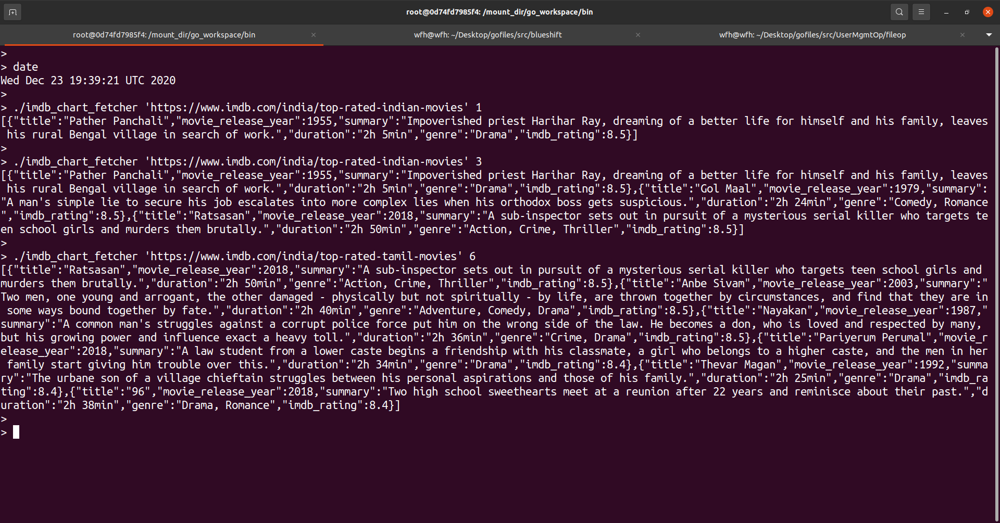

# Imdb-crawler
Backend coding challenge from Sezzle to fetch IMDB charts in Go.

## Implementation

### Problem statement
- [Assignment details](./docs/Sezzle_Assignment_Backend%5B4213%5D.pdf)

### Description
Program takes a particular IMDb URL along with the maximum number of records required & provides the JSON string of the obtained list of movies from the
IMDb website.

The following details of the movies are fetched:
- title
- movie release year
- imdb rating
- summary
- duration
- genre

The program utilizes the concept of Web scraping & Web Crawling to get the movie details from the URL.

### Source Code
- [main.go](./main.go)

### Usage
 ```bash
 ./imdb_chart_fetcher 'chart_url' items_count
 ```
 where
 - `items_count` is the number of movies needed
 - `chart_url` is the IMDb URL to fetch the data from
 - `imdb_chart_fetcher` is the binary

 To create the `imdb_chart_fetcher` binary:
 - Navigate to the folder containing source code [main.go] file. Make sure the `GOPATH` is set to point to the workspace where this program is kept.
 - Build the binary
    ```bash
    go build -o imdb_chart_fetcher .
    ```
 - This should create the executable binary in the current folder

### Working
